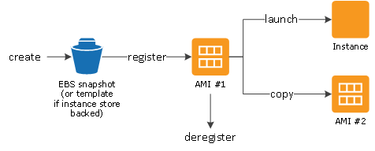

# AWS
## **Wednesday 1/9**:
##### **INSERT IMAGE**
 Previously, we have been working using *monolith architecture*. We are now working towards two-tier architecture.

#### **Today's tasks**:
- Create machine `Linux ubuntu 16.04 - EC2`
- Need to copy app code with `provision.sh`
- Install required dependancies (nodejs, nginx, reverse proxy etc.)
- Security groups for Linux/EC2 instance
- Allow public IP with required ports
from local host to cloud, `ssh`
    - need AWS credentials
    - AWS key
    - sre.pem file save into ssh folder in local host
- MUST NOT SHARE AWS KEYS ANYWHERE --> DO NOT PUSH IT GITHUB OR ANY PUBLIC CLOUD

### Creating New AWS Machine

1. Install NGINX and launch on public IP to ensure access to AWS resources

2. Create instanace on AWS
    - Launch instances:
    - `Amazon Machine Type`: Ubuntu Server 16.04 LTS (HVM), SSD Volume Type -- 64-bit
    - `Instance Type`: t2.micro
    - `Configure Instance Details`: 
    *Number of instances:* 1
    *Network:* default
    *Subnet:* DevOpsStudent default 1a
    *Auto-assign Public IP:* Enable
    - `Storage`: Keep settings
    - `Add Tags`: `Name` `SRE_akunma_app`
    - `Security`:
    *Group Name:* SRE_akunma_app
    *Description:* SRE_akunma_app
    *Type:* SSH *Source:* My IP *Description:* From my IP
    `Add Rule`
    *Type:* HTTP *Source:* Anywhere *Decription:* Public access 

3. In GitBash, `cd` into home and create new directory `.ssh`

4. Download SRE_key and place inside `.ssh`
    - Back to Launch instance wizard --> Click `Launch` --> *Choose an existing key pair*, sre_key|RSA

5. Click on the instance then `connect`
    - Follow instructions under `SSH client` tab
    - Run instance in GitBash using last text string

**Make sure to run all the dependancies that are outlined in the previous *cloud_computing_intro repo* `provision.sh` file**

6. Copy app folder from previous `Vagrantfile` into new machine.
From the `Vagrantfile` directory:
```bash
scp -ri ~/.ssh/sre_key.pem app ubuntu@*Public IP address
*:/home/ubuntu/app
```
7. Run `cd app` then `npm start` after booting up machine
    - Check IP and :3000
    - Can't see port :3000

8. Back on instances page, select the instance 
    - From the Security tab, click on the security group, edit inbound rules and add a new rule
    *Type:* Custom TCP *Port Range:* 3000 *Source:* Anywhere IPv4 0.0.0.0/0
    - Save rules

9. Run machine again, `npm start` --> paste IP address in search bar and the app is running

10. Terminate the machine once you're done, or use `npm stop`

## **Thursday 2/9: 2 Tier Architecture Deployment**


**vs** 

**Monolith architecture:** 
Simple w limitations
Can get slowed down by heavy apps
Challenging to scale up on demand
More suited for simpler/lighter apps

**Two-tier:** 
Dont have to wait on db team to do work

#### **Today's Task:**
- configure reverse proxy w nginx
- set up another ec2 instance w same ubuntu 16.04 to set up mongodb
- connect app with mongodb ec2 to see /posts
- only app can access db (port 27017)
- set up mongodb w same provising script
- change bind IP 0.0.0.0 i mongod.conf
- restart db
- enable db
- check status of db (must be active)
- create env variable DB_HOST=db_ip:27017
#### **2 tier architecture deployment with node -app frontend, mongodb as backend**
<br>

### Creating New Instance for MongoDB

- same steps but do not enable in configure (usually, but in this instance we enable)
- new security group, same first option new rule
custom TCP, 27017 port range, source: anywhere, Desc: add the app instance ip

- run the instance in .ssh directroy (finiah at instll mongodb)
- install all depndancies in mongo provision.sh file
sudo systemctl status mongod
sudo systectl restart
enable
status
cd /etc
sudo nano mongod.conf --> change bindIp to 0.0.0.0
restart
enable

### Configuring App with Reverse Proxy

- follow steps from other repo

### Setting Up DB page (/posts)

sys restaty nginx
create env variable --> DB_HOST
echo "export DB_HOST=*DB IP*:27017/posts" >> ~/.bashrc
source ~/.bashrc
cd app, node seeds/seed.js
sudo npm start

<br>

## Building AMIs



- create AMIs of instances and stop/terminate instance and running state
- want AMI to have mongobd installed
- click instance, actions, image, create image --> name and description: sre_akunma_*instance name*_ami
- sleect AMI click LAunch and use same settings as instance (choose existing security group)

in gitbash: ssh -i "sre_key.pem" ***ubuntu***@ec2-54-228-85-20.eu-west-1.compute.amazonaws.com

- add app_ami ip to security port for db

To Research:

- What is an AMI?

AWS introduction - EC2 instances - Security groups-inbound and outbound rules,  - step by step guide how to deploy 2tier app on aws, building AMIs
